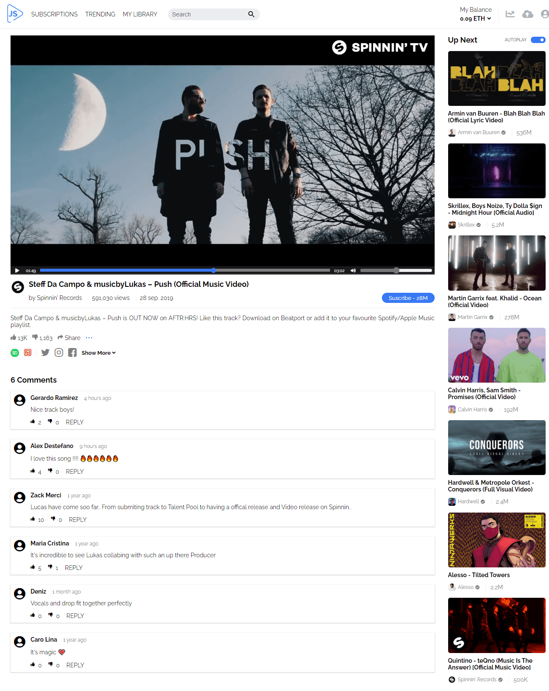

# JS Media Player 🎵

Media Player built with Vanilla JavaScript.

## Table of contents 📑

- [Overview](#overview)
  - [The project](#the-project)
  - [Links](#links)
- [My process](#my-process)
  - [Built with](#built-with)
  - [What I learned](#what-i-learned)
  - [Useful resources](#useful-resources)
- [Author](#author)

## Overview 🔎

### The project

The media player has plugins that allows users to:

- Change current video time with the progress bar.
- Change volume with the sound bar.
- Show video total duration.
- Play/pause the video by clicking the state button or directly the video.
- Auto pause the video when is not visible in the viewport.
- Auto pause the video when the user is not in the media player tab.

### Links

- 📌 Live Site URL: [here](https://g3rardogo.github.io/js-mediaplayer/public/index.html)

## My process 👨‍💻

### Built with

- Semantic HTML5 markup.
- CSS custom properties.
- Flexbox.
- CSS Grid.
- Mobile-first workflow.
- JavaScript.

### What I learned

This was an entertaining project, I made use of different web APIs such a Intersection Observer, Document and HTMLMediaElement. I improved my skills with Vanilla JavaScript using Prototype Inheritance.

### Useful resources

- [All you need to know about Prototypal Inheritance](https://link.medium.com/Y4OmYtyrCib) - This is an important pillar of JavaScript that you must understand.

- [JavaScript bind() Method](https://www.javascripttutorial.net/javascript-bind/) - Lear how to use JavaScript bind() method effectively.

- [How to use Intersection Observers in a Website](https://www.section.io/engineering-education/intersection-observer-api/) - Powerful browser API.

## Author 🐱‍👤

- Website - https://gerardoramirez.netlify.app/
- Twitter - [@g3rardogo](https://www.twitter.com/g3rardogo)
